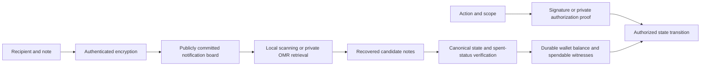

# Mudra signatures, private authorization and wallet recovery

Date: **2026-09-12**. Status: research and proposed decision, not an accepted
protocol change or production qualification. Revisions, source evidence and
executed checks are linked below. Concurrent Neuron and private-proof work was
inspected and preserved.

## Recommended decision

**Keep programmable proof authorization as Cyber's native target. Select
ML-DSA-87 as the proposed default when a conventional, independently verifiable
post-quantum signature is needed. Treat private payment discovery as a separate
protocol, with UnifOMR a strong research candidate.**

This is a role-specific engineering choice, not a proof of universal optimality.
It preserves the reason for Hemera/Zheng while allowing a node, wallet or worker
to authenticate ordinary messages without starting a prover. Adopting the
detached-signature profile would explicitly amend the earlier ambition that
proofs replace *all* signatures, including off-chain messages.

| Role | Proposed choice | Reason and boundary |
|---|---|---|
| Private native operation / ownership | Versioned Hemera lock program + private Zheng execution proof | Can jointly prove authority, state predicates and nullifier rules while hiding the witness. The actual Mudra profile and security qualification are unfinished. |
| Public control messages, receipts, attestations and key bindings | **Pure ML-DSA-87**, exact FIPS 204 context and canonical action envelope | Stateless, fast on the measured host, standardized category 5, independently cross-verifiable. Public signatures do not conceal a subject or message. |
| Explicit bandwidth-sensitive detached-signature profile | ML-DSA-65, only if category 3 is the selected requirement | Saves 1,318 signature bytes and 640 public-key bytes. Do not negotiate down from 87 silently. |
| Infrequent independent recovery/root attestation | Consider SLH-DSA-SHA2-256s | Hash-based alternative independent of the lattice assumption; much larger and slower to sign. Keep its recovery policy independent of a proof verifier whose failure it is meant to survive. |
| Existing Cosmos/browser integration | Preserve secp256k1 / ADR-036 as a named compatibility profile | Existing IDs and wallets retain their meaning. This profile provides no PQ guarantee. |
| Private notification discovery | Evaluate UnifOMR at its stronger parameter set behind a replaceable retrieval interface | Reduces client download/decryption cost; does not supply complete, authenticated wallet state. |

For long-lived secrets, a concrete candidate root policy is 256 bits of generated
entropy, separate domain-derived spending/signing/viewing/recovery keys, and
explicit algorithm and derivation versions. This is a proposed policy, not an
instruction to reinterpret existing seeds or a proof of a whole-system security
level. Algorithms, hash commitments and proof transcripts must meet the same
declared threat model; selecting a category-5 signer alone cannot do that.

## What we had actually chosen

The user correctly remembers an earlier signature choice. Git history gives a
more precise answer than today's files alone:

1. A CyberPatch proposal used Dilithium3 / ML-DSA. On March 2, commit
   `cyber/32961eb0` explicitly removed that independent crypto choice.
2. Later on March 2, `cyber/df8dfa3c` established **Hemera(secret) + proof of a
   programmable lock** as native identity authorization.
3. On March 16, `cyber/8797ff52` added **ML-DSA for P2P and attestations** to
   Mudra. Eleven minutes later, `cyber/815d4180` explicitly removed signatures
   and VRF because proofs should subsume both.
4. The signatureless identity document moved from Cybergraph to Mudra in June.
   July's secp256k1 migration bridge and August's domain-scoped browser signing
   were distinct compatibility decisions.

No surviving finalized Falcon, SLH-DSA, WOTS or Lamport production selection was
found in the searched source/history. The enduring native choice optimized
reuse of the proof stack and programmable authority; it was not backed by an
executed comparison proving that per-message proofs outperform every signature.
[Exact commits, historical paths and search coverage](signature-optimality/local-decisions.md).

The current working Neuron profile names `H(compressed secp256k1 public key)`.
The native design names `H(secret)`. These are different identities, even if
both serialize to 32 bytes. A stable subject surviving key rotation needs an
immutable inception binding plus authorized, versioned policy transitions; it
cannot be implemented by hashing a new key and calling the result the old ID.
Separate workers can receive scoped credentials under that policy. Moving work
between machines or CPU/GPU executors does not require a new subject; network
scope belongs in the authorization statement and policy binding.

## Separate the four security jobs

A signature establishes authorization for bytes under a key. Encryption hides
note contents. Discovery finds a wallet's notes. State verification establishes
their canonical inclusion, spend status and completeness. None of ML-DSA,
SLH-DSA or a bare preimage proof implements all four jobs.

Likewise, a proof with a permanent public subject ID still links that subject's
actions. Sender privacy needs a relation that hides the relevant ownership
binding while revealing only the intended outputs, nullifiers and state claims.
IP addresses, timing, public amounts and indexer queries remain separate leaks.

## Neptune versus Quantus

Snapshot: Neptune Core **0.17.0**, released September 11, commit `34bc7465`;
Neptune desktop wallet **4.2.1**, commit `fff01e70`, actually packages core/wallet
**0.15.0**. Quantus app `e843b06b`, chain release **1.0.1** `f1176cea` and the
chain's pinned circuits **4.3.0** `b224e6dc` are from the earlier same-day audit.
Neither a live mainnet restore nor matched end-to-end transfer benchmarks were
executed. [Neptune release](https://github.com/Neptune-Crypto/neptune-core/releases/tag/v0.17.0),
[versioned evidence](signature-optimality/neptune-evidence.md),
[Quantus snapshot and tests](quantus-identity-privacy.md).

| Criterion | Neptune | Quantus | Consequence for Cyber |
|---|---|---|---|
| Usability | Released desktop light wallet, 18-word restore, local discovery, 25-key look-ahead. Ordinary receipts recover from on-chain notifications; off-chain receipts can need extra payload backups. No current native mobile release established here. | Mobile app includes Wormhole, seed-derived receive/change branches and gap 20. Indexed queries avoid downloading global history; nonstandard derivation paths/external secrets need separate handling. | Quantus supplies useful mobile product patterns; neither seed alone nor a fixed look-ahead guarantees every conceivable receipt is recoverable. |
| Cold restore and warm updates | Cold restore downloads stripped history and scans locally. Warm sync processes new blocks, checks held coins and polls the tip at roughly one minute. Explicit rollback/replay handles reorgs. | Cold restore queries derived address history and nullifiers. Warm reload still revisits address discovery and accumulated wallet history. Source contains an indexer-lag cursor omission; recent-tail rescanning does not establish complete rollback. | Evaluate verified recovery and catch-up cost, not only the time until a balance number appears. |
| Authorization speed | Tiny hash-lock predicate, but private STARK proofs and recursive transaction construction are substantial work. GUI creates a ProofCollection; further proof upgrading is required for block inclusion. | Conventional ML-DSA signs cheaply. Wormhole adds a separate private proving/aggregation path, whose cost is not measured by ML-DSA timing. | Detached message auth and confidential ledger transactions need separate budgets. No defensible current numerical winner for full private transfers. |
| Cryptographic simplicity and reliability | Simple ownership predicate on a large VM/AIR/FRI/transcript/recursive-verifier stack, plus custom lattice notification KEM. Historical soundness failures and corrective rollbacks/relaunch provide concrete failure evidence. | Standard ML-DSA is a narrower, independently testable primitive. Wormhole still depends on a separate proof stack, chain integration and wallet/indexer behavior. Audits are partial and version-specific. | A hash-based authorization predicate does not make the complete cryptographic implementation small. Compare the actual trusted components. |
| Ledger privacy | Normal UTXO contents, amounts and lock policies are hidden by commitments/proofs. Fees, timing, structural metadata and notification receiver identifiers remain public. Address reuse and lustration exceptions matter. | Wormhole conceals deposit-to-exit linkage. Deposit/exit addresses and amounts are public; timing and amounts can narrow the anonymity set. | Neptune is the closer model for native confidential state. Quantus's unlinkability is useful but does not equal amount confidentiality. |
| Query privacy | Common stripped-history requests avoid exposing the ordinary address list. Witness recovery leaks candidate ranges/index sets; special origin recovery queries an exact commitment. GUI still trusts the server for chain selection/completeness. | Current mobile code sends full derived addresses and exact nullifier hashes to Subsquid. CLI's 32-bit nullifier prefixes are usually nearly unique against a public dictionary. | Quantus's fast lookup is partly purchased with indexer visibility; Neptune pays more client download to reduce that disclosure. |
| Post-quantum scope | Hash/preimage STARK spending; default Generation notifications use custom lattice KEM + AES-256-GCM. Optional EC-hybrid mode has explicitly quantum-vulnerable payment-history privacy. Seed and proof parameters have separate limits. | ML-DSA-65/87 are standardized PQ signature profiles. Wormhole's inspected config has a 100-bit minimum security setting; this is not a category-5 or end-to-end quantum claim. | Specify PQ guarantees per component, including seeds, encryption, commitments and proof configuration. |

These are comparisons of inspected mechanisms, not a ranking by token value or
marketing. Quantus's September 9 launch gives it much less operational history;
fewer published incidents would not establish greater reliability.

### Concrete Neptune lessons

The standard lock proof takes the **full transaction-kernel MAST hash** as its
public input and keeps the preimage private. That is the relevant pattern for
Mudra: authority must bind the exact action. A preimage claim detached from an
action is not a reusable authorization protocol. Kernel binding still relies
on sound proof/transcript verification. [Lock and claim construction](signature-optimality/neptune-evidence.md#authorization-and-proof-pipeline).

Current archival core avoids obligatory eager witness updates: it defaults to zero
stored membership proofs and recovers them from archival state on demand. The
light wallet also requests witnesses when spending. Eager per-coin updates
exist as an option; attributing their full cost to every current wallet would
overstate the default overhead. [Witness paths](signature-optimality/neptune-evidence.md#mutator-set-witness-costs-avoid-attributing-optional-work-to-the-default-node).

There is a real local Trisha receipt for a custom-lock transaction against an
isolated Neptune **0.15.1** node: five component proofs followed by a SingleProof;
the latter's proving plus verification took **575.958 seconds**, peak RSS about
**21.7 GiB**, using four threads and no LDE cache. It reached the node's mempool.
That single fixture is not a default transfer benchmark, a mobile measurement,
a mined confirmation, or a measurement of the new 0.17 Forge path.
[Local validation receipt](../../trisha/audit/neptune-local-node-validation.md).

Historical security outcomes include the August 2025 mainnet relaunch after an
inflation bug, the January 2026 Triton soundness disclosure, and another June
recursive-verifier/soundness incident. The 2024 Triton audit covered an older,
limited scope; the June linked investigation includes AI-assisted findings and
does not certify the current complete stack. Current fixes must be evaluated
on their merits; history does not itself prove a surviving exploit.
[Relaunch](https://neptune.cash/articles/mainnet-relaunch),
[January disclosure](https://neptune.cash/articles/critical-vulnerability-disclosure),
[June disclosure](https://talk.neptune.cash/t/critical-vulnerability-discovered/304).

### Quantum security cannot be summarized by one digest length

Neptune's Tip5 digest is 40 bytes and Triton 8 defaults to a **conjectured
160-bit** security parameter. Its master wallet secret nevertheless contains
about **192 bits** of entropy. If an attacker can check a public derived address,
generic quantum search over that seed space takes roughly **2^96 oracle
queries**. This is a theoretical search bound, not an implemented attack or a
wall-clock prediction. Hash expansion cannot increase seed entropy.
[Source and assumptions](signature-optimality/neptune-evidence.md#hash-seed-and-notification-cryptography).

Quantus's category-5 ML-DSA option likewise does not raise the proof system's
security or fix query leakage. A 100-bit proof configuration is not an assertion
of 100 quantum bits. UnifOMR's 110 / >128-bit lattice estimates are a third kind
of claim. They should not be placed in one column labelled "quantum bits".

For Mudra, shortening Hemera output to 32 bytes cannot be justified by choosing
a stronger signature. A conventional signature, identifier commitment and
private proof each depend on their own required hash properties. The current
Hemera parameter source still marks inverse-16 experimental and full-round
security unestablished. This report does not close that separate cryptanalysis.

## Conventional signatures: measured cost and assumptions

These are **OpenSSL 3.6.2 measurements on this Apple M4 Max**, not Quantus Rust
latencies, smartphone measurements or proof-circuit costs. Three trials per
algorithm, one second per keygen/sign/verify phase; table entries are the median
of trial-average operation times. Raw logs, scripts and all samples are saved.
[Benchmark methodology and reproduction](signature-optimality/benchmarks/README.md).

| Algorithm | NIST category | Public key, bytes | Signature, bytes | Sign, ms | Verify, ms |
|---|---:|---:|---:|---:|---:|
| ML-DSA-65 | 3 | 1,952 | 3,309 | 0.472 | 0.094 |
| **ML-DSA-87** | **5** | **2,592** | **4,627** | **0.582** | **0.138** |
| SLH-DSA-SHA2-128s | 1 | 32 | 7,856 | 140.845 | 0.150 |
| SLH-DSA-SHA2-128f | 1 | 32 | 17,088 | 7.479 | 0.537 |
| SLH-DSA-SHA2-256s | 5 | 64 | 29,792 | 312.500 | 0.457 |
| SLH-DSA-SHA2-256f | 5 | 64 | 49,856 | 25.907 | 0.757 |

Parameter sizes/categories come from [FIPS 204, Tables 1–2](https://nvlpubs.nist.gov/nistpubs/FIPS/NIST.FIPS.204.pdf)
and [FIPS 205, Table 2](https://nvlpubs.nist.gov/nistpubs/FIPS/NIST.FIPS.205.pdf#page=53).
NIST categories compare attack resources against specified reference problems;
they are not a count of quantum security bits.

**Why propose 87:** for long-lived high-value authorization, its larger parameter
set costs about 0.11 ms extra signing time on this host and 1,318 extra signature
bytes. This is a reasonable trade given the stated reliability goal. The data
do not establish that 65 is unsafe or that the same latency ratio holds on every
target. At large message volumes, bandwidth/storage may dominate CPU.

**Why retain SLH as an alternative:** it changes the core assumption to standard
hash-based security and keeps tiny public keys. The measured 256s variant is
reasonable for occasional root actions, expensive for frequent attestations.
The 256f variant buys faster signing with a 49,856-byte signature. Neither
variant hides the signer. Replacing its standardized hashes with Hemera would
create a different, separately analyzed construction, not FIPS 205 SLH-DSA.

**Why not make Falcon the default now:** Falcon's published 512/1024 encodings
have signatures of 666/1,280 bytes, excellent when bandwidth dominates. Its
Gaussian/FFT trapdoor sampling adds secret-dependent implementation concerns
beyond checking a short public signature. These are engineering tradeoffs, not
evidence of a current break. NIST's current overview still lists Falcon under
ongoing standardization; do not label a chosen Falcon encoding finalized
FN-DSA/FIPS 206. No same-host Falcon measurement was made here.
[Falcon authors](https://falcon-sign.info/),
[NIST status, updated August 5, 2026](https://csrc.nist.gov/projects/post-quantum-cryptography).

**Why not default to WOTS/XMSS/LMS:** their hash-only attraction is real, but
stateful variants must prevent one-time key reuse across crashes, rollback,
backup restore and parallel signers. That operational requirement conflicts
with casually cloning a seed among workers. Controlled, disjoint subtree
allocation can support specialized deployments; it is a new state-management
contract, not free multi-device signing. [NIST SP 800-208, §§1.2, 7–9](https://nvlpubs.nist.gov/nistpubs/SpecialPublications/NIST.SP.800-208.pdf).

No native timing in this table predicts the cost of verifying these signatures
inside Zheng. If a confidential lock only needs a preimage and policy proof,
inserting a full ML-DSA verification circuit may be unnecessary. Conversely,
existing external signatures may need proof wrapping for interoperability.

### What to take from Quantus

Use its ML-DSA implementation immediately as the **independent cross-check
backend already isolated in this audit**. The earlier same-day harness passed
54 ML-DSA-65/87 cases against OpenSSL, including equal deterministic signatures,
cross-verification, hedged signing and rejection of modified inputs. This is
actual interoperability evidence, not a NIST module certificate or proof of
side-channel resistance. [Executable and boundaries](quantus-mldsa-crosscheck/README.md).

Choose the Mudra *protocol* independently of the Rust provider. The inspected
Quantus crate has useful tests and prior Neodyme review, but that review covers
an older revision, and the crate's GPL-3.0 declaration differs from the repo
root's Apache-2.0 text. Production provider selection needs that boundary
resolved and the post-audit diff reviewed. Do not import Quantus's extrinsic
context, address derivation or Wormhole protocol merely to obtain ML-DSA.
[Pinned adoption evidence](quantus-identity-privacy.md#2-which-quantus-signature-components-to-reuse).

## UnifOMR: what the new paper changes

Ben Fisch, Zeyu Liu, Eran Tromer and Yunhao Wang's **UnifOMR** is directly
relevant to our wallet discovery problem. It lets a server help identify a
recipient's messages without learning which records belong to that recipient.
It changes who performs the expensive work and how much the client downloads.
[Paper, version May 9, 2026](https://eprint.iacr.org/archive/2026/910/1778291181.pdf),
[full paper/source assessment](signature-optimality/unifomr-evidence.md).

The sender attaches an RLWE-encrypted clue to an independently encrypted note.
The recipient uploads an encrypted detection key. The server homomorphically
processes every clue and returns compact partial-decryption results. The client
decrypts/range-checks them locally, then uses **batch PIR** to retrieve matching
notes without revealing their indices. This needs two communication rounds.

The heavy global scan moves to the server, **per queried recipient**. The client
still processes a compact **O(N)** stream, roughly 6.5 or 10 bytes per record for
the detection component at the paper's two parameter sets, before PIR. This
is substantial practical compression, not asymptotically free history access.

Representative author-reported results: N = 524,288 messages, 50 pertinent
messages, 612-byte payloads:

| Metric | Param1 | Param2 |
|---|---:|---:|
| Advertised computational estimate | 110 bits | >128 bits |
| Server runtime | 25 s | 41 s |
| Recipient CPU | 28 ms | 54 ms |
| Reported digest | 4,163 KB | 5,955 KB |
| Separate key material | 31 MB | 48 MB |
| Per-note clue | 2,477 bytes | 2,565 bytes |
| Per-note false-negative target | 2^-30 | 2^-128 |

These are the authors' measurements, not our benchmark. Client CPU excludes
waiting for server/network work. Key upload is additional to digest size, and
public PIR bootstrap data must be accounted for. The smaller cloud instance's
RAM description is inconsistent; the public repository linked by the paper
still exposes the older 2022 OMR implementation. A runnable new UnifOMR artifact
was not found through the checked author/repository routes.

The paper's near-optimality result relates strongly detection-key-unlinkable
OMR to PIR under its model. It does not prove the concrete optimum across
hardware, preprocessing, multiple servers or weaker privacy models. Its
formal definitions use PPT adversaries; lattice ingredients are PQ candidates,
but the table is not an end-to-end QPT security theorem.

### The remaining gap is material for a reliable wallet

1. **Malicious-server privacy is not completeness.** The base correctness
   argument assumes honest-but-curious detection. A server can omit a payment
   without necessarily learning its recipient. Merkle proofs authenticate
   returned records; they do not prove that no matching record was omitted.
   Appendix E explicitly leaves single-server integrity open.
2. **False positives require capacity slack.** Keep true matches T, false
   positives F and PIR capacity B distinct. Require a bounded failure
   probability for `T + F > B`. Printed Algorithm 1 truncates excess candidates;
   the experiment's exact slack accounting could not be resolved without its
   artifact. This is a documented ambiguity, not a demonstrated paper break.
3. **Notification retrieval is not spendable state.** Inclusion, canonical
   roots, nullifier/spent status, membership witnesses, finality, availability
   and reorg rollback require their own verified protocols and durable state.
4. **Privacy must survive wallet behavior.** The paper excludes post-retrieval
   recipient actions from its CPA-like privacy model. Response-dependent
   retries, direct fallback queries or payment reactions can leak information.
5. **The sender and archive pay new costs.** Every compatible payment needs a
   recoverable clue and payload. Param1 adds about 1.21 GiB of clues to the
   example's 306 MiB of payloads. Existing unclued history is not upgraded by
   merely deploying a detector.

For Cyber, trial UnifOMR on committed historical epochs with a deterministic
view-key derivation profile, padded query capacity and explicit overflow
handling. Persist only a *verified* recovery cursor. Keep baseline scanning as
a correctness reference, and specify when fallback is privacy-safe. A full
restore processes historical epochs; warm sync processes newly committed
epochs. Neither mode automatically maintains BBG state witnesses.

## Work that makes this decision implementable

The following is a proposed execution order. This report deliberately stays in
`audit/`; it does not quietly convert research recommendations into accepted
specifications or modify the user's concurrent implementation.

| Order | Concrete deliverable | Evidence required before calling it done |
|---|---|---|
| 1 | Versioned Mudra authorization and identity lifecycle contract | Exact canonical action bytes, signature/proof profile, subject and key-policy binding, chain/genesis, environment/program scope, revision, nonce, replay and recovery rules. Existing identities retain their meaning. |
| 2 | ML-DSA-87 detached-signature adapter and independent CI oracle | External FIPS context vectors; malformed/wrong-key/profile/network/action rejection; literal seed→key→ID vectors; rotation/recovery tests; target custody and error behavior. Resolve implementation license/audit delta. |
| 3 | Real private lock authorization through Zheng | Bind the expected lock program and full action to its witness relation; test wrong secret, substituted action/root/program, replay and leaked-witness paths. Pin Hemera and the actual private proof backend. Measure proof/verify bytes, latency and RAM. |
| 4 | Complete durable identity and wallet state through BBG | Crash/restart tests at acceptance/receipt boundaries, replay across networks, policy rollback/reorg, recovery without stale authority. A key hash alone is insufficient. |
| 5 | Reproducible UnifOMR discovery experiment | Runnable pinned artifact; standard scan as ground truth; Param2 and a complete failure budget; full first restore versus warm sync costs, server cost per user, clues/keys/bootstrap storage, adversarial omission and overflow behavior. |
| 6 | Private retrieval integrated with authenticated state | Canonical epoch/root binding, verified completeness or explicit trust model, membership/nullifier queries, data availability, reorg-safe cursor, padded retries and privacy-safe recovery. |

Current execution evidence matters: Mudra's optional `prove` feature still
fails to compile and its old circuit is an arithmetic demo. Two legacy Zheng
attack regressions still reproduce acceptance of unrelated/zero witnesses;
the newer public execution API binds its relation but discloses witness data.
Concurrent work already includes a distinct private Triton-backed CCS path.
It must be qualified as the actual Mudra authorization route rather than
describing every Zheng entry point as equivalent.
[Readiness tests and concurrent-work boundaries](signature-optimality/local-decisions.md#zheng-readiness-relevant-to-that-decision).

## Evidence inventory

- [Recovered local decisions and executed readiness checks](signature-optimality/local-decisions.md).
- [Neptune release, wallet, cryptography and incident evidence](signature-optimality/neptune-evidence.md).
- [UnifOMR full-paper and public-code assessment](signature-optimality/unifomr-evidence.md).
- [New same-host signature benchmarks, raw logs and reproduction scripts](signature-optimality/benchmarks/README.md).
- [Earlier Quantus signature, circuit, wallet and recovery assessment](quantus-identity-privacy.md).
- [Existing 54-case Quantus/OpenSSL cross-verification executable](quantus-mldsa-crosscheck/README.md).

No new production crypto provider, key migration, live transfer or full-system
security certification is claimed. Unmeasured mobile/proving workloads and the
missing UnifOMR artifact remain explicit limits on the recommendation.
